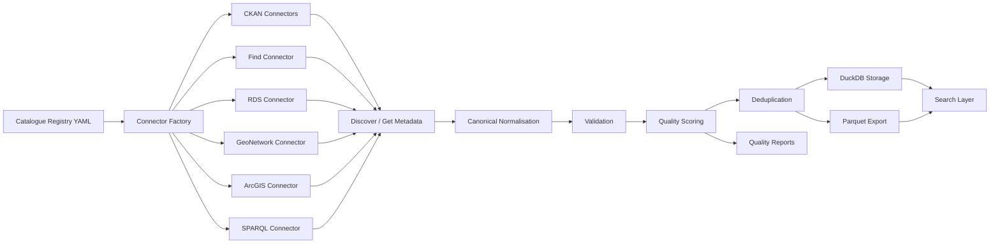

```mermaid
flowchart LR
  A[Catalogue Registry YAML] --> B[Connector Factory]
  B --> C1[CKAN Connectors]
  B --> C2[Find Connector]
  B --> C3[RDS Connector]
  B --> C4[GeoNetwork Connector]
  B --> C5[ArcGIS Connector]
  B --> C6[SPARQL Connector]
  C1 --> D[Discover / Get Metadata]
  C2 --> D
  C3 --> D
  C4 --> D
  C5 --> D
  C6 --> D
  D --> E[Canonical Normalisation]
  E --> F[Validation]
  F --> G[Quality Scoring]
  G --> H[Deduplication]
  H --> I[DuckDB Storage]
  H --> J[Parquet Export]
  I --> K[Search Layer]
  J --> K
  G --> L[Quality Reports]
```

The package separates catalogue-specific harvesting from normalisation and
storage so that new sources can be added without changing downstream search or
reporting code.

